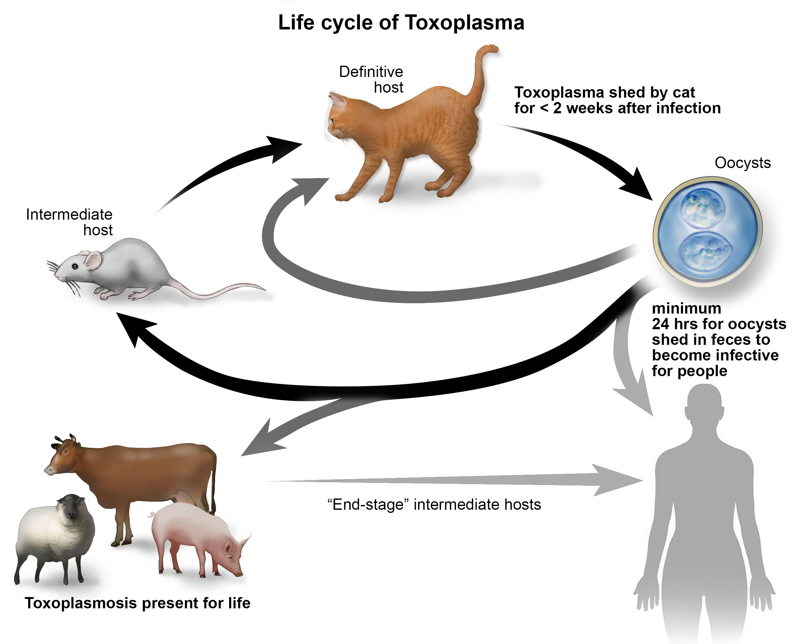
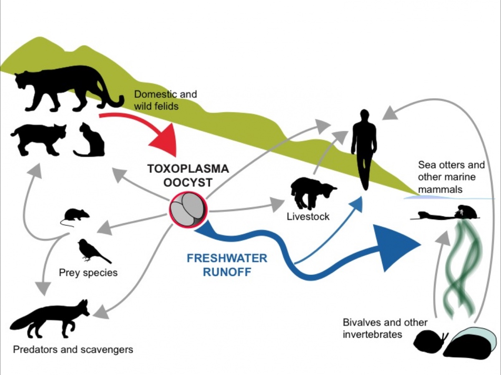
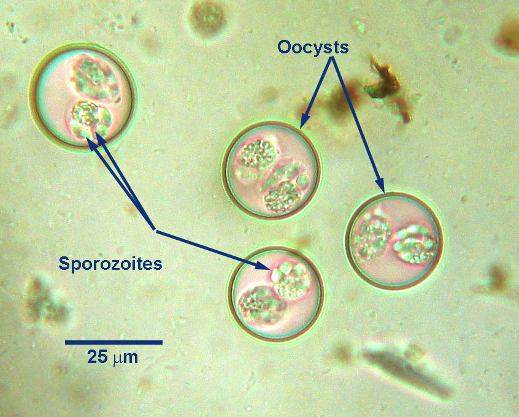
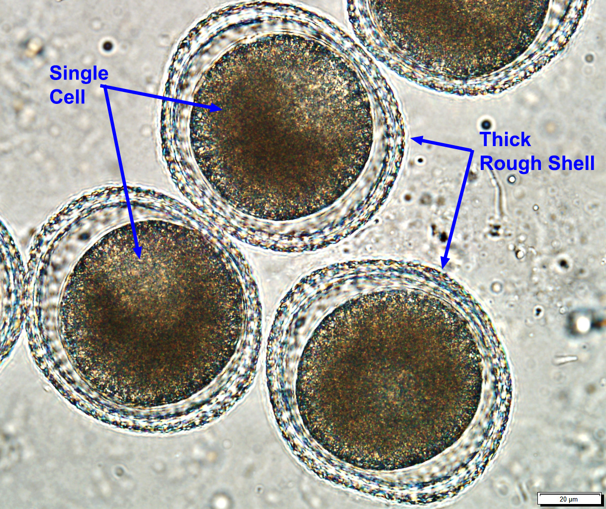
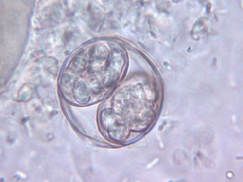
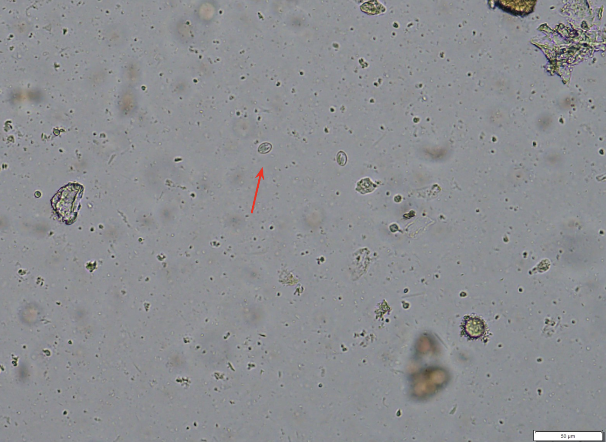

```{r}
#| label: setup
#| include: false

library (tidyverse)
library (naniar)
library("googlesheets4")
library(gt)
library(gtsummary)

```

```{r}
#| label: read-in-sheets
#| include: false

parasites_google <- read_sheet("https://docs.google.com/spreadsheets/d/1_D_1uIb8q3YWYgjvfU5YaZlKYobkUJ53KPPYT4esKig/edit?usp=sharing",
                               col_types = "ccDDnDccclcllcclllllDDDDDDn",
                               na = c("<NA>", "na", "NA"))

write_csv(parasites_google, file = "Data/data-raw/parasites_google.csv")

```

```{r}
#| label: clean-names-of-sheets-version
#| eval: false
#| include: false

parasites_google_clean_1 <- janitor::clean_names(parasites_google)

write_csv(parasites_google_clean_1, file = "Data/data-clean/parasites_google_clean_1.csv")

```


## Background - The Study

Land To Sea is an extension of a previous research study investigating the presence of *toxoplasma gondii* in Monterey Bay.  The study has been picked up again by grad students at UC Davis.  Cats are the definitive host for *toxoplasma gondii*, which is shed via oocytes in their feces.  The feces may be consumed directly or the oocytes can travel through the waterway to food sources, finding their way to various animals including otters and cows.  The Land To Sea study is investigating the connections between these animals by looking at the waterway in conjunction with animals.  The original study publication can be viewed <a href="https://pubmed.ncbi.nlm.nih.gov/27456911/">here</a>.

The lifecycle of toxoplasmosis is illustrated in Image 1 and Image 2.





The Santa Cruz County Animal Shelter (SCCAS) is involved in the study by providing fecal samples of cats that meet certain criteria.  Samples must come from cats of eight weeks of age or older and have spent time outdoors.  Feral/unsocial cats are more likely to have spent more time outdoors, so stray/found cats are preferred over those that were surrendered.

The fecal samples included in this sample were analyzed by the UC Davis lab via fecal flotation and microscopic analysis.  Entirely separate from the Land To Sea study, the provided results were analyzed with the intention of investigating the parasite prevalence at SCCAS to evaluate the current de-worming protocol.  The following is that analysis.


## Background - Parasites

#### Testing

Each cat's fecal float was analyzed for four things:

| Analysis | Description | Image | 
| --- | --- | --- |
| Cystoisospora felis (Coccidia) | Protozoan |  | 
| Toxocara (Roundworms) | Nematode |  | 
| Toxoplasma | Protozoan |  | 
| Sarco-like | Sarcocystis-like sporocysts, no confirmed species |  | 

**Sarco-like is not a specific parasite so it was left out of this analysis.  In the 56 cases analyzed here, none had toxoplasma so it was also left out of this analysis.**

#### Relevant Dewormers

Nemex (pyrantel) is effective against roundworms and hookworms.  Among the parasites tested for in this study, Nemex is only effective against toxocara (roundworms).  This should be repeated every 2-3 weeks until 8-12 weeks of age.

Ponazuril is effective against coccidia.  It should be given at 2-3 weeks of age and repeated once after 7-14 days.

| Dewormer | Effective Against (*involved in this study*) | SCCAS Intake Protocol |
| ----      | ------ | ----| 
| Nemex (pyrantel) | *roundworms*, hookworms | - age 2-16 weeks: give at intake, then two weeks after intake, repeated every 4 weeks until 16 weeks of age - >16 weeks: give at intake, then two weeks after intake |
| Ponazuril | *coccidia* | 2-12 weeks: give once at intake | 
| Fenbendazole (panacur) | *roundworms*, hookworms, whipworms, some tapeworms, and Giardia | not used prophylactically |

<a href = "https://sheltermedicine.wisc.edu/library/resources/intestinal-parasite-control-guidelines">Shelter Medicine Parasite Guidelines</a>


### Nemex Treatment Date Considerations

The date that the animal received treatment relative to testing has an impact on the results.  The treatment protocol requires Nemex every two weeks to keep up with the toxocara lifecycle and ensure complete treatment.  As the time between Nemex increases, the efficacy of the deworming protocol decreases.  Given the shelter atmosphere (high population, limited resources), it felt appropriate to consider Nemex treatment concurrent if treatments were less than four weeks apart.  For more information on how treatment was considered, please read the <a href = "/treatment-considerations">treatment considerations page</a>.


```{r}
#| label: cleanup-for-grade
#| eval: false
#| include: false


parasites_google_clean <- parasites_google_clean_1 |> 
  mutate(temperament = fct_relevel(temperament, 
                                   c("social", "unsocial", "unknown"))) |> 
  mutate(across(c(collection_date, 
                  nemex_1, 
                  nemex_2, 
                  nemex_3), 
                as.Date)) |>
  mutate(across(c(nemex_1, nemex_2, nemex_3), 
                ~case_when(
    is.na(.) ~ as.Date(NA),
    # Only remove if the treatment was between 0 and 14 days BEFORE collection
    (as.numeric(collection_date - .)) >= 0 & (as.numeric(collection_date - .)) < 14 ~ as.Date(NA),
    TRUE ~ . 
  ))) |>
  
  #used posit assistant to figure out how to do this so that if the treatment was less than fourteen days from the collection date, the treatment was not included
  rowwise() |> 
  mutate(nemex_dose_number = sum(!is.na(c_across(nemex_1:nemex_3))),
         ponazuril_dose_number = sum(!is.na(c_across(ponazuril_1:ponazuril_2))),
         panacur_dose_number = sum(!is.na(panacur_1))) |> 
  ungroup() |> 
  select(a_id, 
         collection_date, 
         age_at_collection_yrs, 
         sn_at_collection, 
         sex, 
         health_status, 
         surrendered, 
         temperament, 
         toxocara_roundworms, 
         cystoisospora_felis_coccidia, 
         sarco_like, 
         toxoplasma, 
         parasite, 
         nemex_1,
         nemex_2,
         nemex_3,
         nemex_dose_number, 
         ponazuril_dose_number, 
         panacur_dose_number) |> 
 mutate(age_group = case_when(
      age_at_collection_yrs >= 0.5 ~ "Adult (> 6 months)",
      age_at_collection_yrs < 0.5 & age_at_collection_yrs > 0.2 ~ "Juvenile (3-6 months)",
      age_at_collection_yrs <= 0.2 ~ "Kitten (< 3 months)"
    ))  |> #added an age group variable and grouped the cats by age
  filter(!is.na(toxocara_roundworms)) #do not include cases without results

write_csv(parasites_google_clean, 
          file = "Data/data-clean/parasites_google_clean.csv")

```

```{r}
#| label: cleanup_1
#| eval: false
#| include: false

# note: parasites_google_clean and parasites_google_clean_1 are very similar, but I wanted to have them separate, the main reason being that parasites_google_clean_1 has the nemex dates so I could use it for the treatment considerations page.  

parasites_google_clean_1 <- parasites_google_clean_1 |> 
    mutate(temperament = fct_relevel(temperament, 
                                     c("social", "unsocial", "unknown"))) |> 
rowwise() |> 
  mutate(nemex_dose_number = sum(!is.na(c_across(nemex_1:nemex_3))),
         ponazuril_dose_number = sum(!is.na(c_across(ponazuril_1:ponazuril_2))),
         panacur_dose_number = sum(!is.na(panacur_1))) |> 
  ungroup()

write_csv(parasites_google_clean_1, 
          file = "Data/data-clean/parasites_google_clean_1.csv")
```

```{r}
#| label: lengthen-by-parasite-type
#| eval: false
#| include: false


# lengthen by parasite type
longer_by_parasites <- parasites_google_clean |> 
  pivot_longer(names_to = "parasite_type",
               values_to = "results", 
               cols = toxocara_roundworms: toxoplasma) |> 
  group_by(parasite_type) 

write_csv(longer_by_parasites, file = "Data/data-clean/longer_by_parasites.csv")
```


```{r}
#| label: read-in-data
#| include: false

parasites_google_clean_1 <- read_csv("Data/data-clean/parasites_google_clean_1.csv")

parasites_google_clean <- read_csv("Data/data-clean/parasites_google_clean.csv")

longer_by_parasites <- read_csv("Data/data-clean/longer_by_parasites.csv")
```


```{r}
#| label: parasites-result-reorder-function
#| include: false

parasite_results_reorder <- function(data, x) {
  data |> 
    # 1. Overwrite the original column using := 
    # We use as.character() to bridge the gap between logical and factor
    mutate("{{x}}" := as.character({{x}})) |> 
    
    # 2. Now {{x}} refers to the character version we just made
    mutate("{{x}}" := fct_recode({{x}},
                                 "Positive" = "TRUE", 
                                 "Negative" = "FALSE")) |> 
    
    # 3. Final releveling
    mutate("{{x}}" := fct_relevel({{x}}, 
                                  c("Positive", "Negative")))
}
  
#used Gemini to fix this function... link to pasted conversation: https://docs.google.com/document/d/1rTyVrAumzQIgp8ojepg9mk3BpeZkIY7Joy3Iz8OdFTk/edit?usp=sharing
```


```{r}
#| label: sample-summarize-functions
#| include: false


# bar chart function 

sample_summarize_bar_chart <- function(data, x) { #include data
  data |>
  group_by({{x}}) |> 
 mutate(sn_at_collection = replace_na({{x}}, "Unknown")) |> 
  ggplot(mapping = aes({{x}}, fill = {{x}})) +
  geom_bar() +
    scale_fill_brewer(palette = "Greens", 
                      na.value = "#dbdbdb") +
  guides(fill = "none") +
  theme_bw() +
  scale_x_discrete(drop = FALSE) +
    geom_text(stat = "count", 
              aes(label = after_stat(count)), vjust = -0.5)
}


```


## Sample Demographics & Overview

This sample includes 56 cats from the Santa Cruz County Animal Shelter.


### Age

The average age of the cats sampled was 1.77 years.  The median age of the cats sampled was 1.10 years.

```{r}
#| label: sample-overview-age


parasites_google_clean |> 
  summarize(
    "Average Age (years)" = mean(age_at_collection_yrs, na.rm = TRUE),
    "Median Age (years)" = median (age_at_collection_yrs, na.rm = TRUE)
  ) |> 
  gt()


```

The adult age group was made up of cats over six months of age.  The juvenile age group included cats between three and six months of age.  Cats under three months were considered kittens.  All ages were based on the cat's age at the date and time of collection.

The sample included 43 adult cats (76.8%), 10 juvenile cats (17.9%), 3 cats of unknown age (5.4%), and 0 kittens (0.00%).

```{r}
#| label: sample-overview-age-group

total <- 56

parasites_google_clean |> 
  group_by(age_group) |> 
summarize(
    Total = n(),
    Proportion = n()/total
  ) |> 
  rename("Age Group" = age_group) |> 
  gt()

sample_summarize_bar_chart(parasites_google_clean, 
                           age_group) + 
  labs(
    title = "Age Groups of Sample at Collection",
    x = "Age Group"
  ) 

```

### Spay/Neuter Status & Sex

Of the cats sampled, 62.5% were altered (spayed/neutered, "fixed") (N = 35) while 26.8% were intact (N = 15).  The sample also included 10.7% of cats with unknown spay/neuter status (N = 6).

```{r}
#| label: sample-overview-spay-neuter

parasites_google_clean |> 
  group_by(sn_at_collection) |> 
 mutate(sn_at_collection = replace_na(sn_at_collection, 
                                      "Unknown")) |> 
summarize(
    Total = n(),
     Proportion = n()/total
  ) |> 
  rename("Spayed/Neutered (Fixed) or Intact" = sn_at_collection) |> 
  gt()

sample_summarize_bar_chart(parasites_google_clean, sn_at_collection) + 
  labs(
    title = "Spay/Neuter Status of Sample at Collection",
    x = "Spay/Neuter Status"
  )

```

The sample included 26 spayed females, 11 females, 11 neutered males, 4 males, and 4 unknown cats.  

```{r}
#| label: sample-overview-sex


parasites_google_clean |> 
mutate(sex = fct_collapse(sex,
                          spayed_female = c("spayed_female", "Spayed Female"),
                          female = c("female", "Female"),
                          male = c("male", "Male"),
                          neutered_male = c("Neutered Male", "neutered_male"))) |> 
 group_by (sex) |> 
  summarize (    Total = n(),
     Proportion = n()/total) |> 
  gt()

sample_summarize_bar_chart(parasites_google_clean, sex) + 
  labs(
    title = "Sex of Sample at Collection",
    x = "Sex"
  ) 

```

### Surrendered Status

The vast majority of the cats in the sample were not surrendered (76.8%, N = 43).  These cats were typically stray.  The remaining cats were surrendered to the animal shelter by an owner (23.2%, N = 13).

```{r}
#| label: sample-overview-surrendered

parasites_google_clean |> 
  group_by(surrendered) |> 
   summarize (    Total = n(),
     Proportion = n()/total) |> 
  gt()

sample_summarize_bar_chart(parasites_google_clean, 
                           surrendered) + 
  labs(
    title = "Surrendered Status of Sample at Collection",
    x = "Surrendered Status"
  ) 

```

### Temperament

Of the 56 cats in the sample, 44 were classified as social temperament (78.6%), 10 as unsocial temperament (17.9%), and 2 with temperament unknown (3.6%). 

```{r}
#| label: sample-overview-temperament

parasites_google_clean |> 
  group_by(temperament) |> 
   summarize (    Total = n(),
     Proportion = n()/total) |> 
  gt()

sample_summarize_bar_chart(parasites_google_clean, 
                           temperament) + 
  labs(
    title = "Temperament of Sample at Collection",
    x = "Temperament"
  ) 

```

### Health Status

Over half (62.5%) of the cats were classified as healthy (N = 35).  The remaining cats were classified as sick (10.7%, N = 6) or other (26.8%, N = 15).

```{r}
#| label: sample-overview-health-status

parasites_google_clean |> 
  group_by(health_status) |> 
   summarize (    Total = n(),
     Proportion = n()/total) |> 
  gt()

sample_summarize_bar_chart(parasites_google_clean, 
                           health_status) + 
  labs(
    title = "Health Status of Sample at Collection",
    x = "Health Status"
  ) 

```

## Data Overview

56 cats were evaluated for each of the parasites, with 224 tests total (56*4).  Of these, 17 of the tests were positive (7.59%).  Of the 56 cats, 13 tested positive for one or more parasite (23.2%).

There are currently no cases positive for toxoplasma.  The majority of positive test results are for Coccidia, followed by Roundworms.  16.1% of the cats tested positive for coccidia.   10.7% of the cats tested positive for roundworms. There were 17 total positive test results, though some of these results overlapped as they were from the same case.  (Figure 1, Table 1)

```{r}
#| label: parasites-overview-graphic-for-grade

  
# graphic
 longer_by_parasites |> 
  ggplot(mapping = aes(x = parasite_type, 
                       fill = results)) +
  geom_bar(position = "stack") +
  theme_bw() +
     scale_fill_brewer(palette = "Greens", 
                       na.value = "#dbdbdb",
                       labels = c("Negative", 
                                  "Positive")) +
   labs(x = "Parasite", 
        y = "Counts",
        title = "Figure 1: Results per Parasite",
        fill = "Result") +
   scale_x_discrete(labels = c("Cystoisospora felis (Coccidia)", 
                               "Sarco-like", 
                               "Toxocara (Roundworms)", 
                               "Toxoplasma"))  # x-axis variable labels
 


```

```{r}
#| label: parasite-overview-table


 #table with proportions
  
   longer_by_parasites |> 
  parasite_results_reorder(results) |> 
     mutate(parasite_type = fct_recode(parasite_type,
                                  "Toxocara (Roundworms)" = "toxocara_roundworms",
                                  "Toxoplasma" = "toxoplasma",
            "C. Felis (Coccidia)" = "cystoisospora_felis_coccidia",
            "Sarco-like" = "sarco_like")) |> #changing formatting and case of the parasites
      tbl_summary(by = "results", 
                  include = "parasite_type", 
                  percent = "row",
                  label = list(parasite_type ~ "Parasite Species"),#fixing the parasite type label
                  digits = list(all_categorical() ~ c(0, 1))) |> 
     add_overall(last = TRUE) |> #add column for overall
    modify_header(
    label = "**Parasite**") |> 
     modify_spanning_header(all_stat_cols() ~ "**Results**") |> 
  modify_caption("**Table 1. Parasite Testing Results**")
```

```{r}
#| label: adding-age-group

parasites_google_clean <- parasites_google_clean |> 
mutate(age_group = case_when(
      age_at_collection_yrs >= 0.5 ~ "Adult (> 6 months)",
      age_at_collection_yrs < 0.5 & age_at_collection_yrs > 0.2 ~ "Juvenile (3-6 months)",
      age_at_collection_yrs <= 0.2 ~ "Kitten (< 3 months)",
      is.na(age_at_collection_yrs) ~ "Unknown"
    )) |> 
    mutate(age_group = factor(age_group, levels = c(
    "Kitten (< 3 months)", 
    "Juvenile (3-6 months)", 
    "Adult (> 6 months)",
    "Unknown"
  )))
```

The data from roundworms and coccidia were analyzed further.

## Roundworms

### Overview

There were six cases positive for toxocara (10.7%).  Of these, five had never received Nemex and one had received Nemex only once. (Figure 2, Table 2)


```{r}
#| label: roundworm-and-tx-graphic-for-grade

# Toxocara prevalence and Nemex treatment

parasites_google_clean |> 
  ggplot(mapping = aes(x = nemex_dose_number, fill = toxocara_roundworms)) +
  geom_bar(position = "stack") + #stack to make the results not even
  theme_bw() +
  scale_fill_brewer(palette = "Greens", 
                    na.value = "#dbdbdb",
                    labels = c("Negative", "Positive")) + 
  labs (x = "Number of Nemex Doses Received", 
        y = "Number of Cases", 
        title = "Figure 2: Toxocara (Roundworms) and Nemex Treatment",
        fill = "Toxocara (Roundworms) Result") 
  

```


```{r}
#| label: roundworm-and-tx-table

# Toxocara prevalence and Nemex treatment

parasites_google_clean |> 
  parasite_results_reorder(toxocara_roundworms) |> 
      tbl_summary(by = "toxocara_roundworms", 
                  include = "nemex_dose_number", 
                  percent = "column",
                  label = list(nemex_dose_number ~ "Number of Nemex Doses Received"),#fixing the parasite type label
                  digits = list(all_categorical() ~ c(0, 1))) |> 
     add_overall(last = TRUE) |> #add column for overall
    modify_spanning_header(all_stat_cols() ~ "**Results**") |> 
    modify_caption("**Table 2. Roundworms and Nemex**") 


```


### Age

Of the six cats positive for toxocara, four were adults (>6 months), one was a juvenile (3-6 months), and one was unknown age.  The juvenile and the unknown age cat had never received Nemex treatment.  Three of the adults never received Nemex while one received one single dose.  (Figure 3, Table 3)


```{r}
#| label: positive-roundworm-and-tx-by-age-group-for-grade

parasites_google_clean |> 
  filter(
         toxocara_roundworms == TRUE,
           !is.na(toxocara_roundworms)) |> 
 ggplot(mapping = aes(x = factor(nemex_dose_number), 
                      fill = age_group)) +
  geom_bar(position = "stack") +
theme_bw() +
  scale_fill_brewer(palette = "Greens", 
                    na.value = "#dbdbdb",
                    labels = c("Adult", 
                               "Juvenile", 
                               "Unknown")) + 
  labs (x = "Number of Nemex Doses Received", 
        y = "Positive Roundworms Cases", 
        title = "Figure 3. Positive Roundworms Cases and Nemex Treatment By Age Group",
        fill = "Age Group") 
```


```{r}
#| label: toxocara-nemex-age-group


parasites_google_clean |>
  filter(age_group != "Kitten") |> 
  mutate(age_group = factor(age_group)) |>
  select(toxocara_roundworms, 
         nemex_dose_number, 
         age_group) |> 
  parasite_results_reorder(toxocara_roundworms) |> 
  tbl_strata(
    strata = toxocara_roundworms,
    .tbl_fun =
      ~ .x |>
        tbl_summary(by = nemex_dose_number, 
                    missing = "no") |>
        add_n(),
    .header = "**{strata}**, N = {n}"
  ) |> 
modify_header(
    label = "**Nemex Doses Received**"
  ) |> 
    modify_caption("**Table 3. Roundworms and Nemex by Age Group**") |> 
     modify_spanning_header(all_stat_cols() ~ "**Results**") 
```


## Coccidia

### Overview

There were negative test results for Coccidia among those who did and did not receive ponazuril, however, all of the positive cases did not receive ponazuril.  Nine of the 56 cats tested positive for Coccidia (16.1%).  All nine had never received ponazuril.  (Figure 4, Table 4)

```{r}
#| label: coccidia-results-and-tx

# Coccidia prevalence and ponazuril treatment

parasites_google_clean |> 
  ggplot(mapping = aes(x = factor(ponazuril_dose_number), 
                       fill = cystoisospora_felis_coccidia)) +
  geom_bar(position = "stack") +
  #scale_y_continuous(labels = scales::label_percent()) + 
  theme_bw() +
  scale_fill_brewer(palette = "Greens", 
                    na.value = "#dbdbdb",
                    labels = c("Negative", 
                               "Positive")) + 
  labs (x = "Number of Ponazuril Doses Received", 
        y = "Number of Cats", 
        title = "Figure 4. Coccidia Results and Ponazuril Treatment",
        fill = "Cystoisospora felis (Coccidia) Result") 
  

### add table of results for proportions

### need to remove the NA because it's considering the cases without data - but be specific about the cases, not the ones that just don't have data

```


```{r}
#| label: coccidia-and-tx-table

# Coccidia prevalence and Ponazuril treatment

parasites_google_clean |> 
  parasite_results_reorder(cystoisospora_felis_coccidia) |> 
  tbl_summary(
    by = "cystoisospora_felis_coccidia", 
    include = "ponazuril_dose_number", 
    percent = "column",
    type = list(ponazuril_dose_number ~ "categorical"), #forcing numbers to be treated as rows
    label = list(ponazuril_dose_number ~ "Number of Ponazuril Doses Received"),
    digits = list(all_categorical() ~ c(0, 1))
  ) |> 
  add_overall(last = TRUE) |> 
  modify_spanning_header(all_stat_cols() ~ "**Results**") |> 
  modify_caption("**Table 4. Coccidia and Ponazuril**")

```

```{r}
#| label: chi-square-coccidia
#| include: false

chisq.test(table(parasites_google_clean$ponazuril_dose_number, parasites_google_clean$cystoisospora_felis_coccidia))
```

### Age

Five of the positive cases for Coccidia were adult cats (> 6 months) who had never been treated, three were juvenile (3-6 months), and one was of unknown age.


```{r}
#| label: positive-coccidia-no-tx-by-age-group

# how many of those that didn't receive ponazuril + tested + for coccidia + are adults (over 6 months)


parasites_google_clean |> 
  filter(
    ponazuril_dose_number == 0, #cats that never received ponazuril
         cystoisospora_felis_coccidia == TRUE
    ) |> #cats that tested positive for coccidia
 ggplot(mapping = aes(x = age_group, 
                      fill = age_group)) +
  geom_bar() +
theme_bw() +
  scale_fill_brewer(palette = "Greens", 
                    na.value = "#dbdbdb",
                    labels = c("Adult", 
                               "Juvenile", 
                               "Kitten")) + 
  labs (x = "Age Group", 
        y = "Positive Coccidia Cases", 
        title = "Figure 5. Positive Coccidia Cases For Those Without Ponazuril By Age Group") +
  guides(fill = "none")

  
```


```{r}
#| label: coccidia-ponazuril-age-group


parasites_google_clean |>
  select(cystoisospora_felis_coccidia, 
         ponazuril_dose_number, 
         age_group) |>
  parasite_results_reorder(cystoisospora_felis_coccidia) |> 
  tbl_strata(
    strata = cystoisospora_felis_coccidia,
    .tbl_fun =
      ~ .x |>
        tbl_summary(by = ponazuril_dose_number, 
                    missing = "no") |>
        add_n(),
    .header = "**{strata}**, N = {n}"
  ) |> 
modify_header(
    label = "**Ponazuril Doses Received**"
  ) |> 
    modify_caption("**Table 5. Coccidia and Ponazuril by Age Group**")
```


## Unsocial Cat Specific Evaluation

Unsocial cats are often quite unhandleable causing them to go without medical care, especially non-life-threatening care like deworming (when compared to wound management for example).  The SCCAS veterinarian has requested the exploration of how these unsocial cats have impacted the prior analysis.


### Toxocara and Temperament


  Ignoring the unknown temperament cats, the expectation that unsocial cats receive less treatment is consistent with the nemex doses provided as 80% of the unsocial cats did not receive any nemex.  Only two of the unsocial cats received nemex but they only received one dose.
  Interestingly, only one of the unsocial cats was positive for toxocara.  Based on this data (with a very small sample size), social cats make up fast the majority of the positive results for toxocara.


```{r}
#| label: unsocial-cat-eval-toxocara


# nemex dose numbers and temperament
 
parasites_google_clean |> 
  parasite_results_reorder(toxocara_roundworms) |> 
    mutate(temperament = fct_relevel(temperament, 
                                     c("social", "unsocial", "unknown"))) |> 
  tbl_cross(
    row = temperament,
    col = nemex_dose_number,
    percent = "row",
    label = list(
      nemex_dose_number ~ "Nemex Doses",
      temperament ~ "Temperament"
    )
  )|> 
  bold_labels()


# toxocara results and temperament

parasites_google_clean |> 
    mutate(temperament = fct_relevel(temperament, 
                                     c("social", "unsocial", "unknown"))) |> 
  parasite_results_reorder(toxocara_roundworms) |> 
  tbl_cross(
    row = temperament,
    col = toxocara_roundworms,
    percent = "row",
    label = list(
      toxocara_roundworms ~ "Toxocara (Roundworms)",
      temperament ~ "Temperament"
    )
  ) |> 
  bold_labels()
 

```


### Coccidia and Temperament


 Ignoring the unknown temperament cats, the expectation that unsocial cats receive less treatment is consistent with ponazuril provided as 100% of the unsocial cats did not receive any ponazuril.  
 All of the unsocial cats tested negative for Coccidia.  These cats made up 18% of the cats tested which is a noteable proportion.  This supports the conclusion that Coccidia is of less concern among unsocial cats than social cats.
  

```{r}
#| label: unsocial-cat-eval-coccidia


# ponazuril dose and temperament

parasites_google_clean |> 
  parasite_results_reorder(cystoisospora_felis_coccidia) |> 
    mutate(temperament = fct_relevel(temperament, 
                                     c("social", "unsocial", "unknown"))) |> 
  tbl_cross(
    row = temperament,
    col = ponazuril_dose_number,
    percent = "row",
    label = list(
      ponazuril_dose_number ~ "Ponazuril Doses",
      temperament ~ "Temperament"
    )
  )|> 
  bold_labels()


# toxocara results and temperament

parasites_google_clean |> 
  parasite_results_reorder(cystoisospora_felis_coccidia) |> 
    mutate(temperament = fct_relevel(temperament, 
                                     c("social", "unsocial", "unknown"))) |> 
  tbl_cross(
    row = temperament,
    col = cystoisospora_felis_coccidia,
    percent = "row",
    label = list(
      cystoisospora_felis_coccidia ~ "Coccidia",
      temperament ~ "Temperament"
    )
  )|> 
  bold_labels()

      
```


## Conclusion

  Both Toxocara (roundworms) and Coccidia are prevalent in the SCCAS population.  Of the animals tested, 10.7% tested positive for Toxocara (N = 6).  Of these, 83.3% (five of six) had never recieved nemex with the remaining animal only receiving nemex once.  Of the animals tested, 16.1% tested positive for Coccidia (N = 9).  All of the positive Coccidia cases never received ponazuril.  Based on the analysis alone, the treatment of Coccidia in adult cats via ponazuril should be added to the treatment protocol.  A cost-benefit analysis may be worthwhile to explore the other aspects of expanding the protocol.
  
  For both Toxocara and Coccidia, animals with complete treatment showed success, supporting the efficacy of the current treatment protocols when completed.  This study showed that these two parasites have a considerable presence among the shelter felines as well as exemplified the importance of complete treatment.  

## Discussion

  Shelters often face staffing shortages and other resource challenges which impact how thorough deworming protocols are employed.  Nemex in particular, which requires two doses, poses an increased challenge as the animal must be sought out, reweighed, and then dosed.  The initial nemex dose and ponazuril are given at intake when an animal is easily accessible.
  
  The challenge is asking more of a group of staff that are already overworked and challenged.  That being said, hopefully, the results from this analysis can be communicated to shelter staff to emphasize the importance and impact of complete deworming.
  
  Cats included in this study were selected to satisfy the Land To Sea sample requirements which aims to answer a different research question, specifically selecting cases to maximize the possibility of Toxoplasma presence.  The research protocol indicated only cats above two months of age to be included in the study, limiting the possibility of cats sampled to be within the "kitten" age group (< 3 months).  The kitten age group is especially relevant when considering the shift in the deworming protocol for cats at 12 weeks (3 months), so their lack of representation is noteworthy.
  
  There was no randomness in the cases selected for the study.  As such, the sample is not representative of the population due to undercoverage bias.
  
  
  
> Questions about this analysis should be sent to sequoiafellenbaum@gmail.com.


